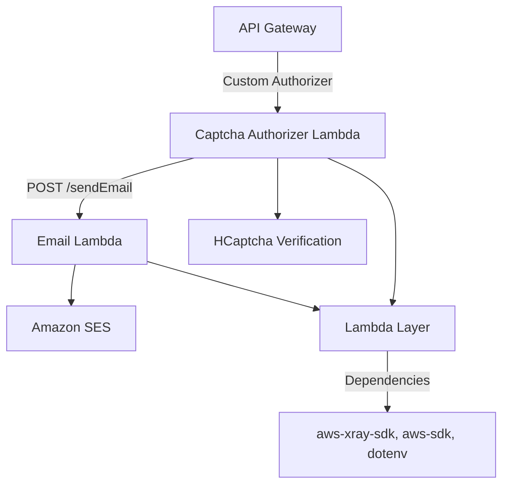

# Portfolio Backend

This is the repository for any server based calls for my [Portfolio Site](https://darker.software)

It is using AWS CDK to define a stack with the relevant resources

## AWS Resources

- Send Email Lambda 
  - This will send emails from the contact form using AWS SES
- Captcha Verify Lambda
  - This validates the captcha on a request with HCaptcha and acts as an authorizer function on the API Gateway
- Lambda Layer
  - This contains common Node dependencies accross the lambda's, currently containing:
    - Dotenv
    - Aws-sdk
    - Aws-xray-sdk
- Api Gateway
  - Endpoints for the app to call to process requests
- IAM Roles
  - For resources to call relevant services i.e. AWS SES

### Stack Diagram

